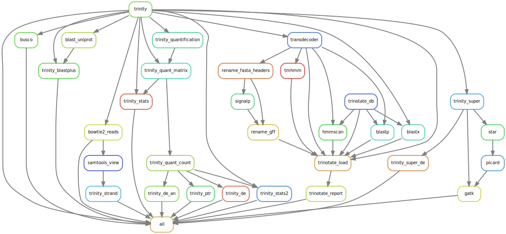

```{r setup, include=FALSE}
rm(list = ls()) ; invisible(gc()) ; set.seed(42)
library(knitr)
library(tidyverse)
theme_set(bayesplot::theme_default())
opts_chunk$set(echo = F, message = F, warning = F, fig.height = 6, fig.width = 8,
               cache = F, cache.lazy = F)
```

[`singularity` & `snakemake`](https://github.com/sylvainschmitt/snakemake_singularity) workflow for trancriptomic analyses of *Aechmea* species.

```{r dag, fig.cap="Workflow."}

```

# Installation

- [x] Python ≥3.5
- [x] Snakemake ≥5.24.1
- [x] Golang ≥1.15.2
- [x] Singularity ≥3.7.3
- [x] This workflow

```{bash, eval=F, echo=T}
# Python
sudo apt-get install python3.5
# Snakemake
sudo apt install snakemake`
# Golang
export VERSION=1.15.8 OS=linux ARCH=amd64  # change this as you need
wget -O /tmp/go${VERSION}.${OS}-${ARCH}.tar.gz https://dl.google.com/go/go${VERSION}.${OS}-${ARCH}.tar.gz && \
sudo tar -C /usr/local -xzf /tmp/go${VERSION}.${OS}-${ARCH}.tar.gz
echo 'export GOPATH=${HOME}/go' >> ~/.bashrc && \
echo 'export PATH=/usr/local/go/bin:${PATH}:${GOPATH}/bin' >> ~/.bashrc && \
source ~/.bashrc
# Singularity
mkdir -p ${GOPATH}/src/github.com/sylabs && \
  cd ${GOPATH}/src/github.com/sylabs && \
  git clone https://github.com/sylabs/singularity.git && \
  cd singularity
git checkout v3.7.3
cd ${GOPATH}/src/github.com/sylabs/singularity && \
  ./mconfig && \
  cd ./builddir && \
  make && \
  sudo make install
# detect Mutations
git clone git@github.com:sylvainschmitt/transcriptoAechmea.git
cd transcriptoAechmea
```

# Usage

## Locally

```{bash, eval=F, echo=T}
snakemake -np -j 3 --resources mem_mb=10000 # dry run
snakemake --dag | dot -Tsvg > dag/dag.svg # dag
snakemake --use-singularity -j 3 --resources mem_mb=10000 # run
```

## genologin

```{bash, eval=F, echo=T}
module load bioinfo/snakemake-5.25.0 # for test on node
snakemake -np # dry run
sbatch job.sh # run
snakemake --dag | dot -Tsvg > dag/dag.svg # dag
```

## Tabebuia

```{bash, eval=F, echo=T}
snakemake -np -j 15 # dry run
snakemake -j 15 --use-singularity --singularity-args "\-B /home/ECOFOG/sylvain.schmitt/Documents/data/Aechmea" # run with binded data
snakemake --dag | dot -Tsvg > dag/dag.svg # dag
```

# Workflow

## Transcriptome

### [trinity](https://github.com/sylvainschmitt/transcriptoAechmea/blob/main/rules/trinity.smk)

* Tools: [trinity](https://github.com/trinityrnaseq/trinityrnaseq/wiki)
* Singularity: https://data.broadinstitute.org/Trinity/TRINITY_SINGULARITY/trinityrnaseq.v2.14.0.simg

## Quality check

### [busco](https://github.com/sylvainschmitt/transcriptoAechmea/blob/main/rules/busco.smk)

* Tools: [busco](https://busco.ezlab.org/)
* Singularity: docker://ezlabgva/busco:v5.2.2_cv2

### [blast uniprot](https://github.com/sylvainschmitt/transcriptoAechmea/blob/main/rules/blast_uniprot.smk)

* Tools: [blastx](https://github.com/trinityrnaseq/trinityrnaseq/wiki/Counting-Full-Length-Trinity-Transcripts)
* Singularity: docker://ncbi/blast
* Base: ftp://ftp.uniprot.org/pub/databases/uniprot/current_release/knowledgebase/complete/uniprot_sprot.fasta.gz

### [trinity blastplus](https://github.com/sylvainschmitt/transcriptoAechmea/blob/main/rules/trinity_blastplus.smk)

* Tools: [analyze_blastPlus_topHit_coverage](https://github.com/trinityrnaseq/trinityrnaseq/wiki/Counting-Full-Length-Trinity-Transcripts)
* Singularity: https://data.broadinstitute.org/Trinity/TRINITY_SINGULARITY/trinityrnaseq.v2.14.0.simg

### [bowtie2 reads](https://github.com/sylvainschmitt/transcriptoAechmea/blob/main/rules/bowtie2_reads.smk)

* Tools: [bowtie2](https://github.com/trinityrnaseq/trinityrnaseq/wiki/RNA-Seq-Read-Representation-by-Trinity-Assembly)
* Singularity: docker://biocontainers/bowtie2

### [trinity stats](https://github.com/sylvainschmitt/transcriptoAechmea/blob/main/rules/trinity_stats.smk)

* Tools: [TrinityStats](https://github.com/trinityrnaseq/trinityrnaseq/wiki/Transcriptome-Contig-Nx-and-ExN50-stats)
* Singularity: https://data.broadinstitute.org/Trinity/TRINITY_SINGULARITY/trinityrnaseq.v2.14.0.simg

### [samtools view](https://github.com/sylvainschmitt/transcriptoAechmea/blob/main/rules/samtools_view.smk)

* Tools: [samtools](https://github.com/trinityrnaseq/trinityrnaseq/wiki/Examine-Strand-Specificity)
* Singularity: docker://biocontainers/samtools

### [trinity strand](https://github.com/sylvainschmitt/transcriptoAechmea/blob/main/rules/trinity_strand.smk)

* Tools: [TrinityStats](https://github.com/trinityrnaseq/trinityrnaseq/wiki/Examine-Strand-Specificity)
* Singularity: https://data.broadinstitute.org/Trinity/TRINITY_SINGULARITY/trinityrnaseq.v2.14.0.simg

### [trinity PtR](https://github.com/sylvainschmitt/transcriptoAechmea/blob/main/rules/trinity_ptr.smk)

* Tools: [PtR](https://github.com/trinityrnaseq/trinityrnaseq/wiki/QC-Samples-and-Biological-Replicates)
* Singularity: https://data.broadinstitute.org/Trinity/TRINITY_SINGULARITY/trinityrnaseq.v2.14.0.simg

## Quantification

### [trinity quantification](https://github.com/sylvainschmitt/transcriptoAechmea/blob/main/rules/trinity_quantification.smk)

* Tools: [align_and_estimate_abundance](https://github.com/trinityrnaseq/trinityrnaseq/wiki/Trinity-Transcript-Quantification)
* Singularity: https://data.broadinstitute.org/Trinity/TRINITY_SINGULARITY/trinityrnaseq.v2.14.0.simg

### [trinity quant matrix](https://github.com/sylvainschmitt/transcriptoAechmea/blob/main/rules/trinity_quant_matrix.smk)

* Tools: [abundance_estimates_to_matrix](https://github.com/trinityrnaseq/trinityrnaseq/wiki/Trinity-Transcript-Quantification)
* Singularity: https://data.broadinstitute.org/Trinity/TRINITY_SINGULARITY/trinityrnaseq.v2.14.0.simg

### [trinity quant count](https://github.com/sylvainschmitt/transcriptoAechmea/blob/main/rules/trinity_quant_count.smk)

* Tools: [count_matrix_features_given_MIN_TPM_threshold](https://github.com/trinityrnaseq/trinityrnaseq/wiki/Trinity-Transcript-Quantification)
* Singularity: https://data.broadinstitute.org/Trinity/TRINITY_SINGULARITY/trinityrnaseq.v2.14.0.simg

## Differential expression

## Super transcripts

## Annotation

